# Hi, I'm IlyaBOT!

**Computer Engineering Enthusiast · Hardware & Software Tinkerer**

I enjoy working where hardware and software meet: building PCs and homelab servers, experimenting with electronics and circuitry, and writing software for the systems around them. Most of my software experience comes from personal projects and university lab work, including web development, systems programming, embedded devices, networking, virtualization, and local AI tooling.

 

## Technical Skills

| Area | Technologies |
| --- | --- |
| Backend | Python, FastAPI, Node.js, REST APIs, SQLAlchemy, Alembic, Prisma |
| Frontend | TypeScript, JavaScript, React, Next.js, HTML, CSS, Tailwind CSS |
| Data | PostgreSQL, MySQL/MariaDB, SQLite, relational database design |
| DevOps & Self-hosting | Docker, Docker Compose, Nginx, Proxmox VE, LXC, Bash scripting, GitHub Actions |
| Programming & Build Tools | C, C++17, C#, CMake, Assembly (MASM32, ASM48), cross-platform development |
| Operating Systems | Windows 3.11–11\*, Linux (Debian- and Arch-based distributions), macOS 10.13–15, legacy Hackintosh systems\*\* |
| Embedded | Arduino/AVR, ESP32/ESP8266, nRF52840, RP2040 |
| Hardware & Networking | Custom PC builds, custom servers built from consumer hardware, basic MikroTik configuration |
| CAD & 3D Printing | Autodesk Fusion 360, Anycubic Kobra 2 Neo |
| Local AI | Ollama, llama.cpp, Open WebUI, ComfyUI, GGUF models, CPU/GPU inference |

\* Windows Server is not included because I have not used it.

** Legacy Hackintosh details

This Hackintosh ran on an HP Pavilion dv6-6c51er (Intel Sandy Bridge). It booted through OpenCore in legacy BIOS mode without UEFI, with its SMBIOS configured to identify the system as a 13-inch MacBook Pro (2011).

## Hardware lab

The machines below are used for development, virtualization, self-hosted services, testing, and hardware experiments.

### My main workstation PC (Untitled for now, I'm choosing between Sombra, Vendetta, Cobalt, Jaguar, or Aurora)

| Component | Configuration |
| --- | --- |
| CPU | AMD Ryzen 7 5700X, 3.6 GHz (4.4 GHz overclock) |
| GPU | MSI GeForce RTX 3060 Gaming X Trio, 12 GB |
| Memory | 32 GB DDR4 GOODRAM IRDM PRO Hollow White (2 × 16 GB) |
| Motherboard | MSI MAG B550 Tomahawk |
| Storage | Patriot P300 256 GB NVMe (Linux) TeamGroup T253X5480G 480 GB SSD (Windows) WD Blue WD5000AAKX-0 500 GB HDD Toshiba MQ01ABD1 1 TB HDD 1 TB RAID 0: Seagate ST500LT012 + Toshiba MQ01ABD0 (2 × 500 GB) Toshiba MK5076GS 500 GB HDD |
| PSU | be quiet! Pure Power 11, 600 W (BN294) |
| OS | EndeavourOS with KDE Plasma · Windows 11 LTSC |

### Virtualization server (ProxMox)

| Component | Configuration |
| --- | --- |
| CPU | Intel Core i3-10105 |
| GPU | Intel UHD Graphics 630 |
| Memory | 32 GB DDR4 (4 × 8 GB) |
| Motherboard | ASUS ROG Strix B560-A Gaming WiFi |
| Storage | TeamGroup TM8FP6128G0C101 128 GB NVMe (ProxMox) 120 GB SSD (For Minecraft servers) Goldenfir 960 GB SSD (For HFS and Samba fileshare) Patriot 500 GB SSD (For torrents and backups) |
| PSU | AeroCool SX-400 |
| OS | Proxmox VE |

### **"HYPERION"** - 2U Rack Server

| Component | Configuration |
| --- | --- |
| Chassis | Some 2U AMI* rackmount, 6 drive caddies |
| Motherboard | Tyan S7050 |
| CPU | 2 × Intel Xeon E5-2660 v2 |
| Memory | 48 GB Samsung DDR3 ECC RDIMM (6 × 8 GB, 3 DIMMs per socket) |
| Storage | Digma DGSR2256GS93T 256 GB SSD Hitachi HTS545050B9A300 500 GB HDD (NTFS; retains data from its previous USB enclosure) Final storage layout TBD |
| PSU | C2W-5820V redundant PSU (1+1, 820 W), dual AC inputs |
| Status | Hardware assembly and storage configuration in progress |

\* [AMI](https://www.pcweek.ua/upload/iblock/233/PCWeek_17s.pdf) was a Ukrainian IT company founded in Donetsk in 1992. It [manufactured computers and servers](https://old.apitu.org.ua/node/475) under its own brand before shifting its focus to system integration; the company's head office was later [listed in Kyiv](https://roi4cio.com/catalog/de/supplier-vendor/ami).

<strong>Legacy server</strong>

| Component | Configuration |
| --- | --- |
| CPU | Intel Xeon X3430, 2.4 GHz |
| Memory | 16 GB DDR3 (KingSpec 8 GB + Patriot 8 GB) |
| Motherboard | ASRock H55M-LE |
| Storage | 120 GB SmartBuy SSD |
| PSU | FSP 400 W |

### **"Vesper"** - Mac mini

| Component | Configuration |
| --- | --- |
| Model | Apple Mac mini (Late 2014) |
